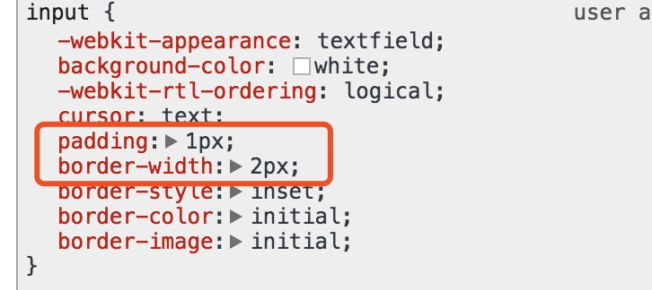

# box-sizing 应用场景

`box-sizing`的属性值分为两个，`border-box`和`content-box`，其中，
`border-box`：width = content + padding + border
`content-box`： width = content

## 应用场景
###  `border-box`属性在form上的使用
 
当在做一个登陆页面的时候，这时候就需要 `input` 等表单元素和 `button` 元素
首先在div中设置两个input，一个用来输入 userName，一个用来输入 password，同时还有一个 login button ， 想让这两个 input 和一个 login button 的长度相同时，把它们的css属性 `width:100%`。


``` html
<div class="container">
    <form action="">
        <input type="text" placeholder="userName">
        <input type="password" placeholder="password">
        <button type="submit">login</button>
    </form>
</div>
```

```css
.container{
  width: 200px;
  min-height: 100px;
  margin: 100px auto;
  border: 1px solid #ccc;
  border-radius: 4px;
  text-align: center;
  padding: 10px;
}
input,button{
  width: 100%;
  margin-bottom: 10px;
}
```

此时会发现长度并不一致:


input 和 login button 的 padding，border值不统一

**input**




**button**


这时给 input 的css属性中添加一个`box-sizing：border-box`，此时表单和按钮的长度保持一致;

```css
.container{
  width: 200px;
  min-height: 100px;
  margin: 100px auto;
  border: 1px solid #ccc;
  border-radius: 4px;
  text-align: center;
  padding: 10px;
}
input,button{
  width: 100%;
  margin-bottom: 10px;
}
input{
  box-sizing: border-box;
}
```


当不给 input 添加`box-sizing：border-box`时，而是添加一个padding值会发现表单的长度增加了。


```css 
input{
  padding: 1px 7px 2px;
}
```


如果给 button 添加 padding 时，它的长度并不会改变，由此可以看出表单默认为`content-box`，input submit默认为`border-box`，button的默认值也为`border-box`

**button**


**input**


<br>

### border-box属性在盒模型中的使用

设置一个宽度为200px的盒子，在里面放入四个盒子，分别为上(width:100%)，中左(width:60%)，中右(width:40%)，下(width: 100%)，此时在大盒子里面四个盒子排列的很整齐


``` html
<div class="container">
    <div class="item"></div>
    <div class="item"></div>
    <div class="item"></div>
    <div class="item"></div>
</div>
```


```css
.container{
  width: 200px;
  overflow: hidden;
  margin: 100px auto;
  border: 10px solid #ccc;
  text-align: center;
}
.item{
  width: 100%;
  height: 50px;
}
.item:nth-child(2){
  width: 60%;
  float: left;
  background: #000000;
}
.item:nth-child(3){
  width: 40%;
  float: left;
  background: #15e8b4;
}
.item:nth-child(4){
  clear: both;
  background: #3483d0;
}

.item:nth-child(1){
  background: red;
}
```

如果给第一个盒子设置一个`padding`或者`border`为5px，第一个盒子的长度就会超出大盒子的宽度


```css
.item:nth-child(1){
  background: red;
  padding: 5px;
}
```


此时修改第一个盒子css属性`box-sizing：border-box`，就能让它宽度不会超出外层盒子


```css
.item:nth-child(1){
  background: red;
  padding: 5px;
  box-sizing: border-box;
}
```


**总结**

**`box-sizing：border-box`**这个属性值可以使dom元素的`padding`和`border`属性值作用于自身，而不对同级的兄弟元素造成影响


    
