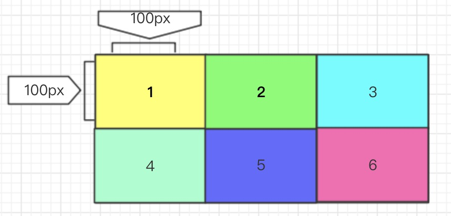
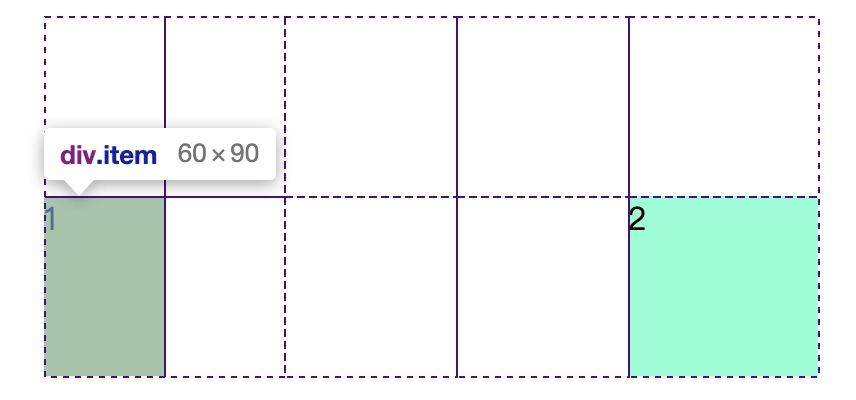

# CSS Grid 

CSS Grid布局，是一个基于网格的二维布局系统，目的是用来优化用户界面设计。

## 启用网格容器

设置Chrome、Opera或者Firefox的特殊标志来启用它。在Chrome或Opera中，在地址栏中输入`chrome://flags（opera://flags）`，然后将`experimental web platform features `选项设置为`enable`；在Firefox中，将`layout.css.grid.enabled`选项设置为可用。

> 使用display属性来定义一个网格容器，它的grid值决定了容器展现为块级还是内联形式。一旦启用网格容器，它的所有子元素都进入grid文档流，称为网格子项。


``` css
display: grid | inline-grid | subgrid
```

* `grid` ：顶一个块级容器
* `inline-grid`: 定义一个内联的网格容器
* `subgrid`: 定义一个继承其父级容器的行和列的大小的网格容器，它是其父级网格容器的子项。

注意：`column`, `float`, `clear`和`vertical-align`对网格容器没有效果。

简单介绍


## Columns(列) 和 rows(行)

语法
```css
grid-template-columns: <track-size> ... | <line-name> <track-size> ...;

grid-template-rows: <track-size> ... | <line-name> <track-size> ...;
```

* `<track-size>`：定义网格单元的宽高，其单位可以是一个长度(如`px`、`em`、`rem`、`vw`、`vh`、`auto`)或百分比，也可以是网格中自由空间的份数(单位为fr)。
* `<line-name>`：定义网格线的名称，它不是必须值。可以一个你选择的任意名字，当没有显示设定时，它的名字以数字表示。

**实例**：

实现一个二维的网格容器，需要定义列和行。创建一个3列和2行的网格。使用`grid-template-row`和`grid-template-column`属性。

``` css
.demo1{
    display: grid;
    grid-template-columns: 100px 100px 100px;
    grid-template-rows: 50px 50px;
}
```

``` html
<div class="demo1">
    <div class="item">1</div>
    <div class="item">2</div>
    <div class="item">3</div>
    <div class="item">4</div>
    <div class="item">5</div>
    <div class="item">6</div>
</div>
```



加深印象修改`columns`和`rows`的值，想想下界面会如何展示：


还可以给网格线指定一个名字：

```css
.container{   
  grid-template-columns: [first] 40px [line2] 50px [line3] auto [col4-start] 50px [five] 40px [end];   
  grid-template-rows: [row1-start] 25% [row1-end] 100px [third-line] auto [last-line];  
}
```


> 注意：网格线命名时必须加上中括号

一根网格线还可以有多个名字，以空格隔开，中括号包裹：

```css
.container{
  grid-template-rows: [row1-start] 25% [row1-end row2-start] 25% [row2-end];  
}
```

如果定义了容器的重复部分，可以使用`repeat()`方法来生成多个相同值

```css
.container{   
  grid-template-columns: repeat(3, 20px [col-start]) 5%;  
}

/* 等价于 */
.container{
  grid-template-columns: 20px [col-start] 20px [col-start] 20px [col-start] 5%;  
}
```

**特殊单元：fr**
`fr`单元允许将网格容器中的自由空间设置为一个份数：

```css
.container{
  grid-template-columns: 1fr 1fr 1fr;  
}
```
在上面的代码中，将网格容器的每个子项设置为三分之一。


## grid-template-areas

`grid-template-areas`配合`grid-area`定义一个显式的网格区域。`grid-template-areas`定义网格区域，然后使用`grid-area`调用声明好的网格区域名称来放置对应的网格项目。

**语法**

```css
grid-template-areas: "<grid-area-name> | . | none | ..." "..." 
```

* `grid-area-name>`：在`grid-area`中指定的网格区域名字
* `.` ：一个句点表示一个空的网格单元
* `none`：没有网格区域被定义

**实例：**
``` html
<div class="container">   
  <div class="item-a"></div>   
  <div class="item-b"></div>   
  <div class="item-c"></div>   
  <div class="item-d"></div>   
</div>
```

```css
.item-a{   
  grid-area: header;  
}  

.item-b{   
  grid-area: main; 
}  

.item-c{   
  grid-area: sidebar; 
}  

.item-d{   
  grid-area: footer; 
}  

.container{    
  width: 300px;
  height:200px;   
  display:grid;   
  grid-template-columns: 1fr 1fr 1fr 1fr;
  grid-template-rows: auto;
  grid-template-areas: "header header header header"   
                       "main main . sidebar"   
                       "header footer header footer";  
}
```


## grid-column-gap/grid-row-gap/grid-gap

指定网格线的大小，也可以说是网格子项之间的间距。

**语法**

```css
grid-column-gap: <line-size>
grid-row-gap: <line-size>
```

* `<line-size>`:长度值

`grid-gap`是`grid-column-gap`和`grid-row-gap`的简称：

```css
grid-gap: <grid-column-gap> <grid-row-gap>
```

如果只有一个值，`grid-row-gap`的值将和`grid-column-gap`一样。

**实例：**
```css
.container {
    display: grid;
    grid-template-columns: 1fr 1fr 1fr 1fr;
    grid-template-rows: auto;
    grid-template-areas: "header header header header" "main main . sidebar" "footer footer footer footer";
    justify-items: center;
    align-items: center;
    grid-row-gap:10px;
    grid-column-gap:10px;
}
```


##  justify-items/align-items

**justify-items**

让网格子项的内容和列轴对齐（`align-items`则相反，是和行轴对齐），这个值对容器里面的所有网格子项都有用。

```css
justify-items: start | end | center | stretch
```

* `start`：内容和网格区域的左边对齐
* `end`：内容和网格区域的右边对齐
* `center`：内容和网格区域的中间对齐
* `stretch`：填充整个网格区域的宽度（默认值）

**align-items**

让网格子项的内容和行轴对齐，这个值对容器里面的所有网格子项都有用。

* `start`：内容和网格区域的左边对齐
* `end`：内容和网格区域的右边对齐
* `center`：内容和网格区域的中间对齐
* `stretch`：填充整个网格区域的宽度（默认值）


## justify-content/align-content

**justify-content/align-content**

如果用像px非弹性单位定义的话，总网格区域大小有可能小于网格容器，这时候可以设置网格的对齐方式（垂直于列网格线对齐）。

```css
justify-content: start | end | center | stretch | space-around | space-between | space-evenly ;
```

* `start`:左对齐
* `end`：右对齐
* `center`：居中对齐
* `stretch`：填充网格容器
* `space-around`：在每个网格子项中间放置均等的空间，在始末两端只有一半大小
* `space-between`：两边对齐，在每个网格子项中间放
置均等的空间，在始末两端没有空间
* `space-evenly`：网格间隔相等，包括始末两端

**align-content**

如果用像px非弹性单位定义的话，总网格区域大小有可能小于网格容器，这时候你可以设置网格的对齐方式（垂直于行网格线对齐）。

```css
align-content: start | end | center | stretch | space-around | space-between | space-evenly 
```

* `start`:左对齐
* `end`：右对齐
* `center`：居中对齐
* `stretch`：填充网格容器
* `space-around`：在每个网格子项中间放置均等的空间，在始末两端只有一半大小
* `space-between`：两边对齐，在每个网格子项中间放
置均等的空间，在始末两端没有空间
* `space-evenly`：网格间隔相等，包括始末两端


## grid-auto-columns/grid-auto-rows

自动生成隐式网格轨道（列和行），定位网格项超出网格容器范围时，将自动创建隐式网格轨道。

```css
grid-auto-columns: <track-size>
grid-auto-rows: <track-size>
```

* `<track-size>`：可以是一个长度，百分比或者是一个网格中自由空间的份数（通过使用fr单位）

**示例**

创建一个 2 x 2 的网格，使用grid-column和grid-row来定位网格子项

```css
.demo3 {
    display: grid;
    grid-template-columns: 60px 60px;
    grid-template-rows: 90px 90px;
}
.demo3>.item:nth-child(1) {
    background: yellow;
    grid-column: 1 / 2;
    grid-row: 2 / 3;
}
.demo3>.item:nth-child(2) {
    background: aquamarine;
    grid-column: 5 / 6;
    grid-row: 2 / 3;
}
```




**grid-auto-flow**

在没有设置网格项的位置时，这个属性控制网格项怎样排列

```css
grid-auto-flow: row | column | row dense | column dense
```

* `row`：按照行依次从左到右排列
* `column`：按照列依次从上到下排列
* `dense`：按先后顺序排列

**示例**

```html
<section class="demo-4">   
  <div class="item-a">item-a</div>   
  <div class="item-b">item-b</div>   
  <div class="item-c">item-c</div>   
  <div class="item-d">item-d</div>   
  <div class="item-e">item-e</div>  
</section>
```

```css
.container{   
  display: grid;   
  grid-template-columns: 60px 60px 60px 60px 60px;   
  grid-template-rows: 30px 30px;   
  grid-auto-flow: row;  
}

.item-a{   
  grid-column: 1;   
  grid-row: 1 / 3;  
}  

.item-e{   
  grid-column: 5;   
  grid-row: 1 / 3;
} 
```


修改 `grid-auto-flow: column`，结果如下：


### grid

`grid`是一种简写形式：

**语法**
```css
grid: none | <grid-template-rows> / <grid-template-columns> | <grid-auto-flow> [<grid-auto-rows> [ / <grid-auto-columns>] ];
```


## 网格item 属性

### grid-column-start/grid-column-end/grid-row-start/grid-row-end/grid-column/grid-row

通过网格线来定义网格项的位置。`grid-column-start`、`grid-row-start`定义网格项的开始位置，`grid-column-end`、`grid-row-end`定义网格项的结束位置。

**语法**

```css
grid-column-start: <number> | <name> | span <number> | span <name> | auto ; 
grid-column-end: <number> | <name> | span <number> | span <name> | auto ;
grid-row-start: <number> | <name> | span <number> | span <name> | auto ; 
grid-row-end: <number> | <name> | span <number> | span <name> | auto ;
```

* <number> | <name>：可以是一个数字以适用被标记了数字号的网格线，或者是一个名字以适用命名了的网格线
* span <number>：子项将跨越指定数字的网格轨迹
* span <name>：子项将跨越指定名字之前的网格线
* auto：自动布局，自动跨越或者默认跨越一个

**示例**

```css
.demo5 {
    display: grid;
    grid-template-columns: 60px 60px 140px 60px [five]60px;
    grid-template-rows: [row1-start]100px 100px 100px;
}
.demo5 .item-a {
    grid-column-start: 2;
    grid-column-end: five;
    grid-row-start: row1-start;
    grid-row-end: 3;
}
```


### grid-area

给子网格命名让它被由`grid-template-areas`属性创建的模板引用。同时，这个属性还可以更简短的表示`grid-row-start`+ `grid-column-start` + `grid-row-end` + `grid-column-end`。

**语法**

```css
grid-area: <name> | <row-start> / <column-start> / <row-end> / <column-end>;
```

* `<name>`：子网格名称
* `<row-start>` / `<column-start>` / `<row-end>` / `<column-end>` – 可以是网格线的数字或名字


###  justify-self/align-self

**justify-self**
让网格子项的内容以列轴对齐（与之相反align-self是跟行轴对齐），这个值可以应用在单个网格子项的内容中。

**语法**

```css
justify-self: start | end | center | stretch
```

* `start` – 让内容在网格区域左对齐
* `end` – 让内容在网格区域右对齐
* `center` – 让内容在网格区域中间对齐
* `stretch` – 填充着呢个网络区域的宽度（默认值）

**align-self**

让网格子项的内容以行轴对齐（与之相反`justify-self`是跟列轴对齐），这个值可以应用在单个网格子项的内容中。

```css
align-self: start | end | center | stretch
```

* `start` – 让内容在网格区域上对齐
* `end` – 让内容在网格区域下对齐
* `center` – 让内容在网格区域中间对齐
* `stretch` – 填充着呢个网络区域的高度（默认值）


